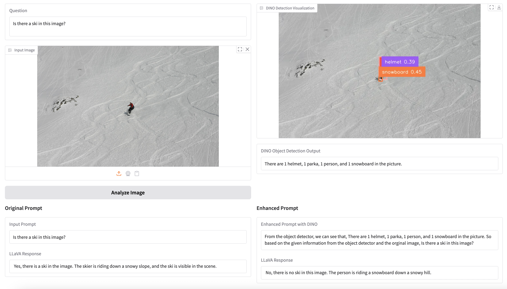

# DINO-X & LLaVA: Visual Question Answering with Object Detection

## Overview

This project implements a visual question-answering system that uses two powerful AI models:
1. **DINO-X**: A state-of-the-art object detection model that identifies and segments objects in images
2. **LLaVA**: A large language and vision assistant that answers questions about images

The LVLM (Large Vision Language Model) works by:
1. First detecting objects in the image using DINO-X API
2. Using the detection results to enhance the question prompt
3. Running the enhanced prompts through LLaVA

## Experiment
The DINO-X & LLaVA integration was developed and evaluated through systematic experimentation documented in the DINO-LLaVA notebook. The research process involved:

 **Benchmark Testing**: The system was evaluated using the [POPE](https://github.com/RUCAIBox/POPE) (Prompt-based Object Perception Evaluation) benchmark, which tests the model's ability to accurately perceive and reason about objects in [COCO Dataset](https://cocodataset.org/#home), a comprehensive collection of images with detailed object annotations, to ensure robust object detection and question-answering capabilities.

The final evaluation results demonstrate the enhanced performance of the DINO-X & LLaVA system compared to baseline models. These results are visualized in the performance comparison chart below:


The chart shows the accuracy improvements achieved through the DINO-X enhanced prompting approach across different question types and image categories.


For a detailed walkthrough of the implementation, please refer to the [DINO-LLaVA Demo Notebook](DINO-DINOX-Llava_Experimentation.ipynb).


## A Demo of the enhanced LVLM using Gradio App

- Interactive web interface using Gradio
- Real-time object detection and visualization
- Side-by-side comparison of original and enhanced responses
- Support for custom questions about any uploaded image
- Automatic prompt enhancement using detected objects

### Prerequisites
- Python 3.8 or higher
- CUDA-capable GPU (recommended for optimal performance)
- DINO-X API key
- Google Colab is recommended for running the code (T4 is sufficient for this demo)

### Installation

1. Install required packages:
```bash
pip install -r DX_LLaVA_requirements.txt
```

### Usage

1. Start the application:
```bash
python DX_LLaVA_main.py
```

2. When prompted, enter your DINO-X API key

3. DINO-X API key can be applied at [request API token website](https://cloud.deepdataspace.com/apply-token?from=github). Free credits will be given for first-time-users. Details for DINO-X platform can be found [here](https://github.com/IDEA-Research/DINO-X-API)

3. The application will launch a web interface (please use the link of Running on public URL)

4. Using the interface:
   - Upload an image using the "Input Image" section
   - Enter your question in the "Question" textbox
   - Click "Analyze Image" to process
   - View the results:
     - DINO detection visualization
     - Detected objects list
     - Original LLaVA response
     - Enhanced LLaVA response with object detection context

### How it works

1. **Object Detection**: The system uses DINO-X to detect and segment objects in the input image without using any prompt.
2. **Prompt Enhancement**: Detected objects are used to create an enhanced prompt
3. **Dual Processing**: The system processes both the original and enhanced prompts through LLaVA
4. **Response Comparison**: Users can compare how object detection context affects the model's responses



## Security Note

- The API key is requested securely at runtime using `getpass`
- Never commit your API key to version control
- Keep your API key private and secure


## Acknowledgments

- This work is based on [DINO-X](https://github.com/IDEA-Research/DINO-X-API/) by IDEA Research.
- We used the [LLaVA](https://github.com/haotian-liu/LLaVA) model as vision language base model.
- Checkpoint of LLaVA is downloaded from [Hugging Face](https://huggingface.co/llava-hf/llava-1.5-7b-hf) by using huggingface API.
- We used the [POPE](https://github.com/RUCAIBox/POPE) benchmark to evaluate the performance of the DINO-X & LLaVA system.
